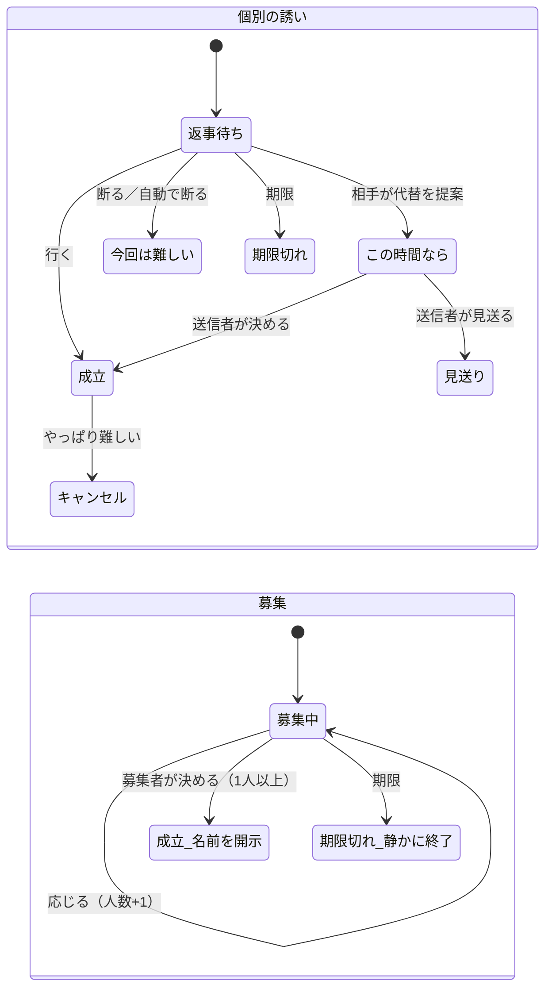
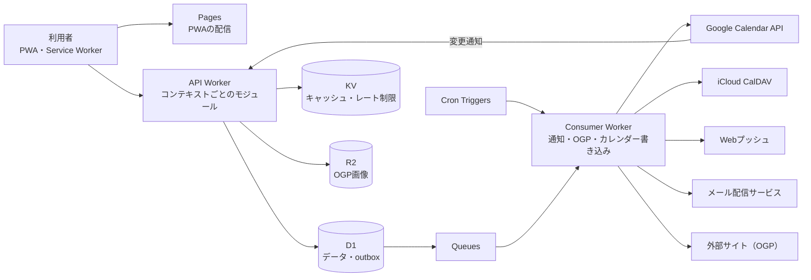

# ここ暇 要求定義書 v0.2

2026-10-07 時点。共同編集の原本はClaude Docsにあり、このファイルはその写しです。

## 概要

「ここ暇」は、友達を誘う気まずさをなくし、会う機会を増やすためのWebサービスです。予定調整の効率化ではなく、誘う側の心理的ハードルを下げることを価値の核に置きます。

| 項目 | 内容 |
| --- | --- |
| 目的 | 誘う気まずさをなくし、会う機会を増やす |
| 価値の核 | 暇がなくても誘える「ここどう？」、角の立たない返答、匿名の募集 |
| 形態 | PWA（Web）先行。アプリ未導入の友達もWebで閲覧・返答できる |
| 開発の動機 | 開発者自身が使いたいサービスとして作る |
| 収益 | 当面は無料。広告は入れない。将来は企業タイアップを想定 |

## ターゲットと利用シーン

| 項目 | 内容 |
| --- | --- |
| 初期ユーザー | 地元の友達（開発者本人とその周り） |
| 居住エリア | バラバラで混在している |
| カレンダー | GoogleとAppleが混在。カレンダーを使わない人もいる前提 |
| 一番の課題 | 誘うこと自体が気まずい |
| 既存の手段 | LINEグループ。LINEではなくこのサービスを使う理由が必要 |
| 対象外（初期） | 仕事の会議調整、家族の予定共有 |

## 用語定義

| 画面の言葉 | ドメインの名前 | 意味 |
| --- | --- | --- |
| ここ暇 | Availability | 「誘っていい」という許可のサイン。保存は常に時刻の範囲 |
| 時間帯プリセット | Preset | 昼・夕方・夜の入力ショートカット。境界はユーザーが変更可能 |
| くり返し | RecurrenceRule | 毎週の基本暇。実予定が入った日だけ自動で外れる |
| 誘い（個別） | DirectInvite | 1人への提案。枠と重なれば「あそぼ」、重ならなければ「ここどう？」 |
| 募集 | Broadcast | 複数人への「暇な人いる？」 |
| 行く | Accept | 承諾 |
| 今回は難しい | Decline | 理由を持たない断り |
| この時間なら | CounterProposal | 代替の時間の提案 |
| 決める | Decide | 募集の締め。応じた人全員に名前を開示する |
| 成立した予定 | Meetup | 会うことが決まった予定 |
| やっぱり難しい | MeetupCancel | 成立後の定型のキャンセル |
| 見せる／見せない | SharingPolicy | 自分のここ暇を友達ごとに見せるかどうか |
| 招待リンク | InviteLink | 期限と人数上限つきの友達追加リンク |

## 機能要件

| ID | 機能 | 確定した仕様 |
| --- | --- | --- |
| F-01 | 認証 | アカウント登録必須。GoogleとSign in with Apple（メールログインはなし）。アカウント連携は設定画面から手動。ログインとカレンダー許可は分ける |
| F-02 | カレンダー連携 | Google（OAuth）とApple（CalDAV）。空き／埋まりのみ取得し、予定の中身は取得・保存しない |
| F-03 | ここ暇の設定 | プリセット（昼・夕方・夜）と開始〜終了の両対応。カレンダーの空きを候補表示し、ワンタップで設定 |
| F-04 | 時間帯プリセット | 初期値は昼11〜15時、夕方16〜19時、夜19〜23時。ユーザーが境界を変更できる。変更しても既存の枠は変わらない |
| F-05 | くり返し | 曜日と時間帯で毎週の基本暇を設定。データはルールと例外の2層 |
| F-06 | 自動取り消し | 連携済みの人は、実予定が入ったらここ暇を自動で取り消し、本人に通知 |
| F-07 | 公開範囲 | 友達ごとに見せる／見せないを選択。初期値は「見せる」。見せない相手には「暇がない」と区別できない表示 |
| F-08 | 友達追加 | 期限と人数上限つきの招待リンクを都度発行。開いてログインすると即友達。友達追加時に通知し、通知から公開をオフにできる |
| F-09 | 友達解除 | 静かに解除（通知なし）。ブロックなし。発行者のリンクを再度開けば友達に戻る |
| F-10 | 個別の誘い | 日時、エリア（任意）、ひとこと、リンク（任意）、期限（送信時に選択） |
| F-11 | 募集 | 応じた人は人数のみ表示。「決める」で応じた人全員へ名前を開示。期限切れは静かに終了し、再募集できる |
| F-12 | 返答 | 行く／今回は難しい／この時間なら。断りは柔らかい定型表現に統一 |
| F-13 | 成立 | GoogleとAppleの双方に自動登録。Apple未連携の人は.icsで保存 |
| F-14 | 成立後のキャンセル | 定型の「やっぱり難しい」を送るのみ。再調整はしない |
| F-15 | リンクとOGPプレビュー | 誘いにURLを1件添付。送信時にOGPを取得・保存し、カードで表示。失敗時はドメインのみ |
| F-16 | 通知 | Webプッシュとメール |
| F-17 | 退会 | 本人のデータを削除。相手側の履歴は「退会したユーザー」と表示 |

## 状態遷移とビジネスルール

誘いは必ず「成立」か「静かに終わる」のどちらかに進み、断りや期限切れで相手に理由が伝わることはありません。

- ここ暇は時刻の範囲で保存し、プリセットは入力のショートカットとして扱う。重なりの判定も時刻で行う。
- 友達に見せるときは「夜 19:00〜23:00」のように時刻を必ず併記する。
- 実予定が入ったここ暇は自動で取り消し、その枠への未返答の誘いは自動で「今回は難しい」を返す。理由は送信者に伝えない。
- くり返しの枠は、ルールから生成し、実予定で外れた日は例外として扱う。
- 友達関係は、招待リンクの発行者と、開いてログインした人の間に成立する。解除は相手に通知しない。

## 非機能要件とアーキテクチャ

| ID | 要件 |
| --- | --- |
| NF-01 | バックエンドはCloudflare Workersを基盤とし、D1・KV・R2・Queues・Cronで構成する |
| NF-02 | 外部連携（通知、OGP、カレンダー書き込み）はQueues経由の非同期処理とし、失敗時は再試行する |
| NF-03 | 状態更新とイベントの受け渡しはOutboxパターンで行い、状態遷移は条件付き更新で二重処理を防ぐ |
| NF-04 | 認証情報はSecretsの鍵でアプリ側暗号化して保存する |
| NF-05 | ドメイン層はCloudflareに依存しないTypeScriptで書き、単体テストで検証する |
| NF-06 | カレンダー連携はプロバイダを抽象化し、Google・Apple・将来のOutlookを差し替え可能にする |
| NF-07 | 通知は1日の上限とユーザーごとの停止設定を持ち、自動取り消しはまとめて通知する |
| NF-08 | 個人が特定されない集計で、ユーザー数・成立数・エリア分布を計測する |
| NF-09 | 無料プランのCPU時間制限を踏まえ、有料プランを前提とする（最新の上限は公式で確認） |
| NF-10 | Apple CalDAVのWorkersからの接続性を、実装着手前に検証する |

## 技術選定

Cloudflare Workersを基盤に、フロントとAPIで型と入力検証のスキーマを共有するpnpmのモノレポで構成します。

| 領域 | 選定 | 理由 |
| --- | --- | --- |
| APIフレームワーク | Hono | Workers向けで軽く、認証をミドルウェアで挟みやすい |
| フロントエンド | React＋Vite（PWA） | 実装LLMが最も正確に書ける |
| スタイル | Tailwind CSS＋デザイントークン | トークンをそのまま設定に落とせる |
| データ取得 | TanStack Query | キャッシュと重複排除、返答などの楽観的更新が書きやすい |
| 入力検証 | Zod | APIとフロントでスキーマと型を共有できる |
| DBアクセス | Drizzle ORM（D1） | 型安全で、認可条件をSQLに明示しやすい |
| テスト | 単体：Vitest＋Cloudflareのworkers向けプール、E2E：Playwright | 単体はD1込みの本物に近い環境で、E2Eは利用者の流れを実ブラウザで確かめる |
| JWT・暗号 | jose（WebCrypto） | Workersで動く定番。暗号処理は自作しない |
| メール配信 | 外部のメール配信サービスをAPIで利用（サービスは要選定） | Cloudflareのメール機能は任意宛先の通知向きではない |
| Webプッシュ | Workers（WebCrypto）で動く実装 | Node向けのライブラリはそのまま動かないことがある |
| パッケージ管理 | pnpmのモノレポ（apps/web、apps/api、packages/shared） | 型とスキーマを1か所で管理する |
| CI | GitHub Actions＋依存更新の自動プルリクエスト | 更新を日単位で回す運用に必要 |
| 監視 | Workers Logs＋利用料アラート | 異常検知と、利用料の急増への備え |
| IaC | 暫定：Terraform（Cloudflareプロバイダv5）＋wrangler。Alchemyとの比較検証（T-00）で確定する。決定は `docs/decisions/0001-iac-tool.md` | 最初からコードで管理し、セキュリティ設定の再現性と変更履歴を確保する |

ライブラリのバージョンや対応状況は変わりやすいため、採用時に公式ドキュメントで確認します。

## ドメイン設計（DDD）

軽量DDDを採用し、集約とドメインイベントを厚く作るのはコアのInvitationだけにします。

| コンテキスト | 区分 | 中身 |
| --- | --- | --- |
| Invitation | コア | 個別の誘い、募集、返答、期限、成立 |
| Availability | 支援 | ここ暇、くり返し、プリセット、公開ポリシー |
| Social | 支援 | 友達関係、招待リンク、解除 |
| Calendar Integration | 支援（腐敗防止層） | Google／Apple連携、空き取得、成立時の書き込み |
| Notification | 汎用 | Webプッシュ、メール |
| Link Preview | 汎用 | OGP取得、画像プロキシ |
| Identity | 汎用 | ログイン、退会 |

- **DirectInvite**：友達にしか送れず、自分には送れない。期限後は返答できない。状態は定められた順にしか進まない。
- **Broadcast**：「決める」まで応じた人の名前を誰にも開示しない（募集者本人にも人数のみ）。決められるのは募集者だけで、応じた人が1人以上のとき。決定後と期限後は応答できない。
- 共通の値オブジェクト：TimeSlot、Area、Link（http/httpsのみ）、Expiry。

| イベント | 発生元 | 受け取る側の動き |
| --- | --- | --- |
| CalendarBusyDetected | Calendar | Availabilityが該当のここ暇を取り消す |
| AvailabilityCancelledByCalendar | Availability | 未返答の誘いを「今回は難しい」にする／本人に通知 |
| MeetupConfirmed | Invitation | Calendarが双方に書き込む／通知 |
| BroadcastDecided | Invitation | Meetupを作成し、参加者全員に名前を開示して通知 |
| BroadcastExpired | Invitation | 状態のみ更新。通知は送らない |
| MeetupCancelled | Invitation | カレンダーから削除し、定型文で通知 |
| FriendshipEstablished | Social | 本人に通知し、公開オフの導線を出す |
| UserWithdrew | Identity | 本人データを削除し、相手側は表示を置換 |

## 収益と拡張の方針

当面は無料で運営し、広告は入れません。将来は、会うことが決まった後の行動につながる企業タイアップ（店や施設の提案枠、特典）を想定します。

- タイアップでは、カレンダーや友達関係のデータをターゲティングに使わない。使うのは本人が入力したエリアなどに限る。
- ユーザー数、成立数、エリア別の分布を、個人が特定されない集計で最初から計測する。
- 場所とリンクを拡張しやすいデータ構造、無料・有料を切り替えられるプランの概念、成立ログを持っておく。

フェーズ：Phase 1（MVP、地元の友達でクローズド運用）→ Phase 2（グループ単位の公開、週次通知、最近会っていない友達、Outlook連携）→ Phase 3（場所・店の提案とタイアップ、推薦）。北極星指標は、週あたりの成立した誘いの数。

## リスクと対策

| リスク | 影響 | 対策 |
| --- | --- | --- |
| Apple CalDAVの接続性・手間 | MVPの遅延、登録時の離脱 | 着手前に検証。Apple連携は任意とし、未連携者は.icsで代替 |
| 友達が使わない | 誘いが成立しない | 「ここどう？」、Webで返答可能、LINEに貼れる招待リンク |
| ここ暇を設定しない | 一覧が空になる | 空きの候補表示、ワンタップ設定、くり返し |
| 断りの気まずさ | 利用が止まる | 定型の返答、募集の匿名性、期限切れは無通知 |
| リンク流出 | 意図しない相手にここ暇が見える | リンクの期限・人数上限・無効化、追加通知から公開オフ |
| iOSのWebプッシュが届かない | 誘いに気づかない | メール通知を併用 |
| Googleのセンシティブスコープ審査 | 公開の遅延 | 最小スコープ、ログインと連携の分離、早めの準備 |
| LINEで足りると言われる | 使う理由がない | 気まずさを消す体験とカレンダー自動登録で差を出す |

## 未決事項

- [ ] 通知の種別と頻度、メールにする通知、停止設定、自動取り消しのまとめ通知
- [ ] 招待リンクの有効期限と人数上限のデフォルト値（モックでは3日間・5人）
- [ ] 表示名・アイコン・プロフィール項目、居住エリアの持ち方
- [ ] ひとことの不適切利用への対策
- [ ] 募集で名前が開示された後の「やっぱり行けない」の扱い
- [ ] タイムゾーンと言語（海外在住の友達がいる場合）
- [ ] Apple CalDAVのWorkersからの接続性の技術検証
- [ ] IaCツールの選定（Alchemy／Terraform）の技術検証（T-00）

## セキュリティ設計

カレンダーの認証情報と行動の情報（ここ暇・エリア）を最優先で守り、友達本人にも隠した情報を推測させないことを方針とします。詳しいルールは `.claude/claude-security-guidance.md` にもあります。

### 守る資産
1. カレンダーの認証情報（Googleのトークン、Appleのアプリ用パスワード）
2. ここ暇とエリア（いつ、どのあたりで空いているかという行動の情報）
3. 友達関係と誘いの内容
4. メールアドレスなどのアカウント情報

### 想定する脅威（STRIDE）

| 分類 | ここ暇での脅威 | 対策 |
| --- | --- | --- |
| なりすまし | 他人のアカウントでのログイン、偽の招待ページ | Google／Appleのみ。IDトークンの署名・発行者・宛先を検証、state・nonce・PKCE。新端末のログインをメール通知 |
| 改ざん | 他人の誘いの状態変更、トークンの改ざん | JWTの署名検証、集約による状態遷移、条件付き更新、HSTS |
| 否認 | 「送っていない」「変えていない」 | 監査ログを30日保持。追記専用 |
| 情報漏洩 | 「見せない」や募集の応答者の推測、トークン漏洩 | 応答の形で区別させない、認証情報の暗号化、ログに個人情報を出さない |
| サービス拒否 | 誘いの連投、OGPの大量取得、外部APIの枯渇、利用料の急増 | 送信上限とレート制限、外部APIの上限とバックオフ、利用料アラート |
| 権限昇格 | 友達でない人のデータ取得、運営機能の悪用 | 認可をクエリに組み込み自動テストで確認、運営機能は公開APIと分離 |

### 認証とセッション

| 項目 | 仕様 |
| --- | --- |
| ログイン手段 | Google、Sign in with Apple |
| アクセストークン | 有効期限10〜15分のJWT。メモリにのみ保持。署名鍵はSecrets、鍵IDで切り替え可能 |
| 更新用トークン | HttpOnly・Secure・SameSiteのCookie。D1にはハッシュのみ。使用ごとに交換し、再利用を検知したら系列ごと失効 |
| CSRF対策 | 更新用エンドポイントはOriginヘッダーも検査 |
| 全端末ログアウト | 更新用トークンをすべて失効。重要操作では失効状態を都度確認 |
| 新端末のログイン | メールで本人に通知 |
| アカウント連携 | 両方のプロバイダで再認証してから手動で連携。使用中のIDは連携不可。解除はログイン手段が1つ以上残るときのみ |
| Appleの中継メール | 送信ドメインをAppleに登録 |

### 認可と情報の秘匿
- データを取得する処理は必ず閲覧者のIDを引数に取り、友達関係と公開設定の条件をクエリに組み込む。
- 他人のIDを指定しても取得できないことを、全APIについて自動テストで確認する。
- 「見せない」相手と「暇がない」相手、募集の応答者の有無は、APIの応答の形・項目・エラーで区別できないようにする。

### 悪用対策と運用
- 誘い・募集の送信上限：1日20件
- OGP取得：ユーザーごとのレート制限、同一URLはキャッシュ
- 監査ログ：ログイン、カレンダー連携、公開設定の変更を30日間保持

### AI時代の攻撃を前提にした運用
- 依存パッケージの更新を自動のプルリクエストで受け、重大な脆弱性は日単位で反映する。修正までのつなぎにWAFのマネージドルールを使う。
- 外に出ている窓口（PWA、API、Webhookの受け口）を一覧にし、使わないルートは閉じる。
- 検知から遮断を自動化する（エッジのレート制限、ボット対策、異常のアラート）。
- 保存するデータを減らし、漏れたときの被害を小さくする。
- 通知メールにはログイン用のリンクを入れず、送信ドメインにSPF・DKIM・DMARCを設定する。
- 開発でAIエージェントを使う場合、そのAPIキーは本番の資格情報と同じに扱い、本番の秘密情報を渡さない。

### 開発・運営アカウントの保護
- Cloudflare、GitHub、Google Cloud、Apple Developerはパスキーまたは物理キーの多要素認証を必須にする。
- CloudflareのAPIトークンは用途ごとに分け、権限を最小にする。

### 受容したリスク
- 招待リンクを開いた人は即友達になる。期限・人数上限・無効化と、友達追加の通知からの公開オフで担保する。
- 解除した相手も、発行者のリンクを再び開けば友達に戻る。
- ここ暇の初期公開は「見せる」で、セキュアバイデフォルトの例外。

### テスト環境の認証
- E2Eテストでは本物のGoogle／Appleにログインしない。E2E環境でのみ有効なテスト用ログインを使い、本番のビルドには物理的に含めない。CIで本番のビルドにテスト用の経路が含まれていないことを確認する。
- 外部サービス（Google、iCloud、メール配信、Webプッシュ）は、E2E環境では偽の実装に差し替える。

### 残りの論点

**MVP（友達とのクローズド運用）までに必須**
- [ ] 開発・運営アカウントのパスキー化とAPIトークンの棚卸し
- [ ] Googleの具体的なスコープの確定（空き時間の取得と予定の作成）
- [ ] 入力のスキーマ検証の方式と、各項目の文字数上限
- [ ] XSS対策（エスケープ、Content-Security-Policy）
- [ ] 招待リンクのトークン設計（十分な長さのランダム値、ハッシュでの保存）
- [ ] 送信ドメインのSPF・DKIM・DMARCの設定
- [ ] 依存パッケージの更新の自動化と、重大な脆弱性を反映するまでの期限
- [ ] 外部API呼び出しの上限・バックオフと、利用料アラートの閾値

**一般公開までに必須**
- [ ] Googleの審査要件とプライバシーポリシーへの反映
- [ ] 招待リンク発行など、その他のレート制限の値
- [ ] 異常検知のアラートの条件と通知先
- [ ] 暗号鍵とJWT署名鍵のローテーション手順

**公開後でよい**
- [ ] 運営用機能の範囲と保護方法
